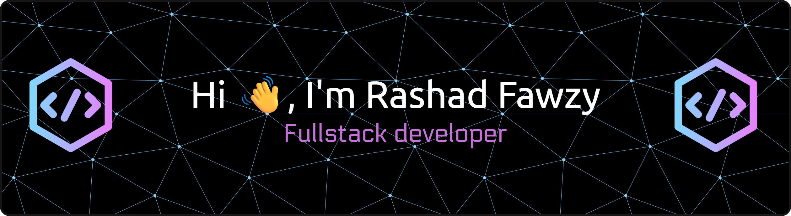

### A passionate Full Stack Developer Indonesian

  

- 🔭 I'm currently working on **a full stack web with Typescript based**

- 🌱 I'm currently learning **software maintenance and workflow**

- 👯 I'm looking to collaborate on **commitment project**

- 🤝 I'm looking for help with **learning operation system**

- 💬 Ask me about **web development, backend project, php and js**

- 📫 How to reach me **cyberrashad@gmail.com**

- ⚡ Fun fact **pure coffee is me**

- 👨‍💻 All of my projects are available at **[https://personal-web-rashad.vercel.app/](https://personal-web-rashad.vercel.app/)**

- 📄 Know about my experiences **[https://drive.google.com/file/d/1MIbniyU7YXv5PICqL9oC1-PlTPuEvyar/view?usp=drive_link](https://drive.google.com/file/d/1MIbniyU7YXv5PICqL9oC1-PlTPuEvyar/view?usp=drive_link)**

###

<picture data-importer="pacman">
  <source media="(prefers-color-scheme: dark)" srcset="https://raw.githubusercontent.com/VibraHub-MasanganKulon/VibraHub-MasanganKulon/pacman-output/pacman-contribution-graph-dark.svg?game=pacman">
  <source media="(prefers-color-scheme: light)" srcset="https://raw.githubusercontent.com/VibraHub-MasanganKulon/VibraHub-MasanganKulon/pacman-output/pacman-contribution-graph.svg?game=pacman">
  
</picture>

###

<h3 align="left">Connect with me:</h3>

<h3 align="left">Languages and Tools:</h3>

                                  

###